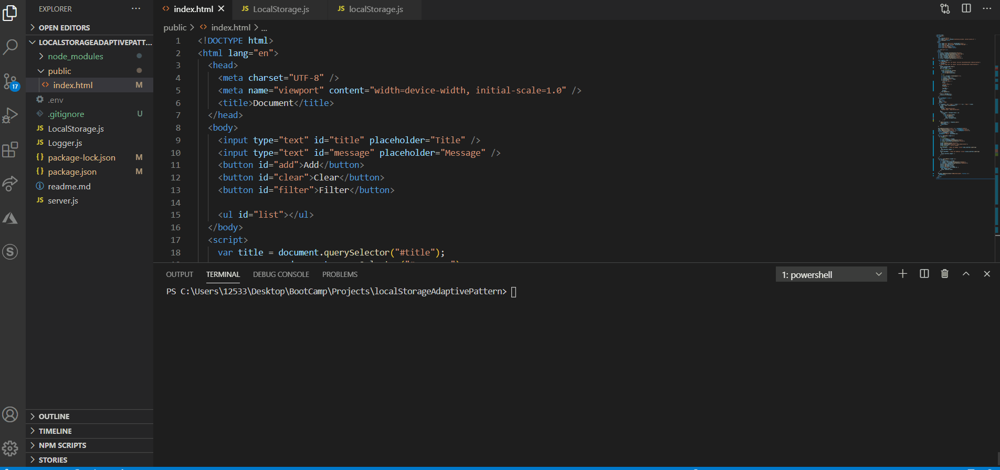

## Example

## Features
* utilizes ES2015, with no third party libraries (outside of cors and express).
* uses factory & addaptive design pattern on server.
* all vanilla javascript on front end.
* Heavy DOM manipulation.
* Dynamic local storage functionality.
* Implimented a variation of object decoration for functionality of server side local storage.
* Able to read, write, update, delate one, delete many, & filter data.
## Future additions
* replace cors & express dependencies with http & url built in features
* create custom search bar to filter via key/values.

